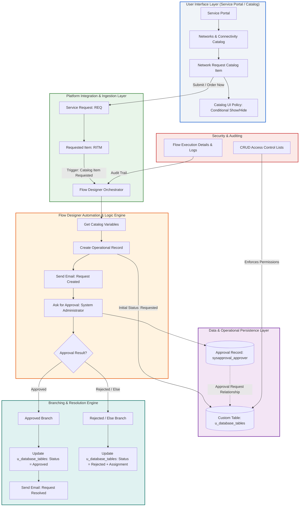
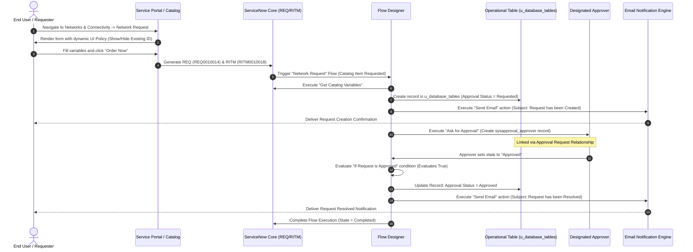

# Automated Network Request Management in ServiceNow

[](https://www.servicenow.com)
[](./2.%20Requirement%20Analysis%20Phase/Solution%20Requirements.pdf)
[](./Workflows/Complete%20End%20to%20End%20Workflow.pdf)
[](./6.%20Project%20Documentation/Functional%20Specification%20Document.pdf)
[-success?style=for-the-badge)](./5.%20Project%20Development%20Phase/User%20Acceptance%20Testing/UAT%20Execution%20Report.pdf)

> **Enterprise Low-Code Network Request Lifecycle Automation**  
> An automated, auditable, and end-to-end Service Catalog and Flow Designer solution implemented on the ServiceNow cloud platform. It standardizes network service intake, enforces dynamic client-side policies, provisions custom operational records, orchestrates multi-tiered approvals, generates automated lifecycle email notifications, and maintains full bidirectional traceability from request creation to fulfillment resolution.

---

## Table of Contents

1. [Executive Summary](#executive-summary)
2. [Business Problems & Solution Objectives](#business-problems--solution-objectives)
3. [System Architecture](#system-architecture)
4. [End-to-End Workflow & Execution Path](#end-to-end-workflow--execution-path)
5. [Core Functional Modules](#core-functional-modules)
   - [Service Catalog & Request Intake](#1-service-catalog--request-intake)
   - [Client-Side UI Policies & Validation](#2-client-side-ui-policies--validation)
   - [Flow Designer Orchestration Engine](#3-flow-designer-orchestration-engine)
   - [Operational Data Model (u_database_tables)](#4-operational-data-model-u_database_tables)
   - [Approval Architecture & Decision Routing](#5-approval-architecture--decision-routing)
   - [Automated Email Notification System](#6-automated-email-notification-system)
   - [Access Control & Security Model (ACLs)](#7-access-control--security-model-acls)
6. [Data Model & Field Dictionary](#data-model--field-dictionary)
7. [Agile Project Planning & Sprints](#agile-project-planning--sprints)
8. [Quality Assurance & Validation](#quality-assurance--validation)
   - [Functional Performance Test Matrix](#functional-performance-test-matrix)
   - [User Acceptance Testing (UAT) & Defect Resolution](#user-acceptance-testing-uat--defect-resolution)
9. [Complete Project Repository & Artifact Directory](#complete-project-repository--artifact-directory)
10. [Setup & Deployment Guide](#setup--deployment-guide)
11. [Runtime Verification & Operational Evidence](#runtime-verification--operational-evidence)
12. [Project Boundaries & Future Scope](#project-boundaries--future-scope)

---

## Executive Summary

Enterprise network service requests—including bandwidth modifications, new IP provisioning, VPN configurations, and hardware connection setups—frequently suffer from fragmented intake channels, missing technical parameters, delayed manual email approvals, and poor status visibility.

**Automated Network Request Management in ServiceNow** resolves these operational inefficiencies by establishing a centralized, configuration-driven low-code workflow on the ServiceNow platform. By combining a dedicated **Service Catalog Item** under the *Networks and Connectivity* category, dynamic **Catalog UI Policies**, an automated **Flow Designer** orchestration flow, a dedicated operational table (`u_database_tables`), and robust **Access Control Lists (ACLs)**, the solution delivers seamless self-service, rapid governance approvals, and immediate operational tracking.

### Key Metrics & Demonstrated Results
- **Intake Standardization**: 100% structured data capture with validated variables and dynamic field visibility.
- **Cycle Time Reduction**: Eradication of back-and-forth manual email handoffs for routine network requests.
- **Approval Automation**: Immediate trigger-driven routing to designated authorities with instant decision-branch evaluation.
- **Operational Traceability**: End-to-end auditability connecting `REQ` (Service Request), `RITM` (Requested Item), operational records, approval history, and system email logs.

---

## Business Problems & Solution Objectives

### The Legacy Operational Challenge
- **Fragmented Submission Channels**: Requests submitted via informal emails, chat messages, or paper forms resulted in inconsistent data.
- **Incomplete Technical Requirements**: Network engineers frequently had to pause work to request missing contact details, connection types, or system identifiers.
- **Manual Approval Bottlenecks**: Approvals relied on untracked email chains, causing significant turnaround delays and audit vulnerabilities.
- **Zero Transparency for End Users**: Requesters lacked visibility into where their request was held, leading to repeated follow-ups.

### Strategic Solution Objectives
1. **Standardize Intake**: Deliver a modern, guided Service Catalog form on the ServiceNow Service Portal.
2. **Automate Orchestration**: Eliminate manual administrative handoffs using ServiceNow Flow Designer.
3. **Isolate Operational Context**: Store and manipulate request attributes in a custom operational record (`u_database_tables`) while preserving standard ServiceNow `REQ`/`RITM` tracking.
4. **Enforce Governance**: Implement role-based approval routing and strict table-level CRUD permissions.
5. **Continuous Communication**: Dispatch automatic status updates to stakeholders at request creation and request resolution.

---

## System Architecture

The solution uses a layered, cloud-native architecture natively hosted within ServiceNow, eliminating external middleware dependencies while maximizing maintainability and platform stability.



---

## End-to-End Workflow & Execution Path

The complete runtime path has been fully implemented, executed, and validated in ServiceNow. The sequence below details the stage-by-stage progression from user submission to fulfillment closure:



---

## Core Functional Modules

### 1. Service Catalog & Request Intake
- **Category Location**: `Service Catalog` &rarr; `Networks and Connectivity`.
- **Catalog Item**: `Network Request`.
- **Intake Scope**: Collects user identity, contact details, connectivity specifications, existing hardware/network references, financial allocation, and billing address.
- **User Experience**: Embedded into the enterprise Service Portal for simplified access by any corporate employee.

### 2. Client-Side UI Policies & Validation
- **Policy Name**: `visible/hide of ID field`.
- **Logic**: Evaluates the `Type of Connection` selection in real time.
- **Behavior**:
  - Automatically unhides the `Enter your Existing ID` field when the selected connection type requires an existing circuit/device context.
  - Hides and clears the input when new provisioning does not require a prior reference ID.
  - Ensures clean data integrity without cumbersome custom JavaScript scripts.

### 3. Flow Designer Orchestration Engine
- **Engine**: Native ServiceNow Workflow Studio / Flow Designer.
- **Trigger**: `Service Catalog` &rarr; `Catalog Item Requested` (`sc_req_item`).
- **Sequential Actions**:
  1. **Get Catalog Variables**: Extracts structured inputs from the requested item context.
  2. **Create Record**: Inserts an operational record into `u_database_tables`.
  3. **Send Email (Creation)**: Emits acknowledgement to requester.
  4. **Ask for Approval**: Creates approval task routed to System Administrator.
  5. **Branching Condition**: Evaluates approval decision (`Approved` vs. `Else`).
  6. **Update Record**: Persists final status in `u_database_tables`.
  7. **Send Email (Resolution)**: Emits final resolution notice upon approval.

### 4. Operational Data Model (`u_database_tables`)
- **Table Label**: `Database Tables`
- **Technical Name**: `u_database_tables`
- **Purpose**: Serves as the operational clearinghouse for technical network provisioning. Separating the operational fields into `u_database_tables` ensures that network fulfillment engineers have a tailored operational schema while standard ITSM ticket lifecycle is tracked via standard `REQ` and `RITM` records.

### 5. Approval Architecture & Decision Routing
- **Rule Type**: `Anyone approves`.
- **Designated Approver**: System Administrator / Network Operations Manager.
- **Relationship**: Custom configured `Approval Request` related list mapping `u_database_tables` directly to `sysapproval_approver`.
- **Dual Branching**:
  - **Approved Branch**: Triggered when status is approved &rarr; Sets status to `Approved` &rarr; Sends `Request has been Resolved` notification.
  - **Else (Rejected) Branch**: Triggered if rejected &rarr; Sets status to `Rejected` &rarr; Assigns to configured support group for remediation.

### 6. Automated Email Notification System
- **Notification 1 — Request Intake Confirmation**:
  - Trigger: Immediately following insertion into `u_database_tables`.
  - Subject: `Request has been Created`.
  - Body: Acknowledges receipt, provides reference numbers, and outlines approval expectation.
- **Notification 2 — Request Resolution / Fulfillment**:
  - Trigger: Following successful approval and record update.
  - Subject: `Request has been Resolved`.
  - Body: Confirms fulfillment authorization and technical resolution details.

### 7. Access Control & Security Model (ACLs)
Granular record-level Access Control Lists (ACLs) are configured on `u_database_tables`:
- **Create ACL**: Restricts operational record creation to Flow Designer system execution context and designated IT admins.
- **Read ACL**: Permits requesters to view their own records, and operations/approvers to inspect assigned records.
- **Write ACL**: Permits approvers and network operators to update operational states.
- **Delete ACL**: Strictly locked to ServiceNow System Administrators to safeguard audit trails.

---

## Data Model & Field Dictionary

### Custom Operational Entity: `u_database_tables`

| Field Label | Technical Column Name | Data Type | Mandatory | Description & Mapping Source |
| :--- | :--- | :--- | :---: | :--- |
| **Request Number** | `u_request_number` | String | Yes | Form submission identifier mapped from catalog variable |
| **Database Number** | `u_database_number` | String | Yes | Operational reference/circuit database tracking key |
| **Address** | `u_address` | String (Multi-line) | Yes | Installation/site physical or network subnet address |
| **Mode of Payment** | `u_mode_of_payment` | Choice / String | Yes | Billing method (Cost Center, PO, Corporate Allocation) |
| **Total Amount** | `u_total_amount` | Decimal / Currency | Yes | Budgetary or operational cost for network service |
| **Mobile Number** | `u_mobile_number` | String | Yes | Direct contact mobile number of the requester |
| **Type of Connection**| `u_type_of_connection`| Choice / String | Yes | Connection profile (LAN, Dedicated Leased Line, VPN, WiFi) |
| **Requested For** | `u_requested_for` | Reference (`sys_user`) | Yes | Target user profile for whom connection is established |
| **Existing ID** | `u_existing_id` | String | Conditional| Previous network circuit ID or port ID (controlled by UI Policy) |
| **Approval Status** | `u_approval_status` | Choice | Yes | Workflow state: `Requested`, `Approved`, `Rejected` |

### Core ITSM Platform Entity Links

| Entity Level | ServiceNow Table | Demonstrated Record ID | Relationship |
| :--- | :--- | :--- | :--- |
| **Service Request** | `sc_request` | `REQ0010014` | Top-level catalog shopping cart request |
| **Requested Item** | `sc_req_item` | `RITM0010018` | Specific item requested; triggers Flow Designer |
| **Operational Table**| `u_database_tables` | Configured Record | Operational clearinghouse populated by flow |
| **Approval Record** | `sysapproval_approver` | Configured Approval | Approval record linked via Approval Request list |
| **System Mailbox** | `sys_email` | Logged Emails | Outbound messages for creation and resolution |

---

## Agile Project Planning & Sprints

The implementation followed an Agile delivery methodology divided across 4 structured sprints, totaling **44 Story Points** using Fibonacci estimation (1, 2, 3, 5).

```
   Sprint 1 (9 pts)           Sprint 2 (15 pts)          Sprint 3 (11 pts)           Sprint 4 (9 pts)
┌──────────────────────┐   ┌──────────────────────┐   ┌──────────────────────┐   ┌──────────────────────┐
│ Catalog & Form Setup │──>│ Workflow & Approvals │──>│ Notify, Sec & Fulfill│──>│ Testing & Deployment │
└──────────────────────┘   └──────────────────────┘   └──────────────────────┘   └──────────────────────┘
```

| Sprint | Story ID | Story & Task Description | Story Points | Status |
| :--- | :--- | :--- | :---: | :---: |
| **Sprint 1** | **USN-1** | Create Network Request Catalog Item under Networks & Connectivity | 3 | Done |
| | **USN-2** | Configure requester, connection, and financial catalog variables | 3 | Done |
| | **USN-3** | Configure Requester Information variable set and Catalog UI Policy | 3 | Done |
| **Sprint 2** | **USN-4** | Configure Flow Designer trigger and Get Catalog Variables action | 5 | Done |
| | **USN-5** | Create custom table `u_database_tables` and build Create Record mapping | 5 | Done |
| | **USN-6** | Configure Ask for Approval and approval-status branching logic | 3 | Done |
| | **USN-7** | Maintain REQ/RITM lifecycle context and state synchronization | 2 | Done |
| **Sprint 3** | **USN-8** | Configure Request Created and Request Resolved Send Email actions | 3 | Done |
| | **USN-9** | Configure Create, Read, Write, and Delete ACLs on `u_database_tables` | 3 | Done |
| | **USN-10**| Configure Approval Request relationship and related list views | 3 | Done |
| | **USN-11**| Validate fulfillment team operational handoff and status transitions | 2 | Done |
| **Sprint 4** | **USN-12**| Execute functional, cross-browser, and performance test suites | 3 | Done |
| | **USN-13**| Perform User Acceptance Testing (UAT) and remediate identified bugs | 3 | Done |
| | **USN-14**| Complete project documentation, operational workflows, and demo pack | 3 | Done |
| **Total** | | **Comprehensive Sprint Effort** | **44 pts** | **100% Complete** |

---

## Quality Assurance & Validation

### Functional Performance Test Matrix

The test suite thoroughly verified functional accuracy, user interface rules, automation flows, and error handling.

| Test ID | Test Scenario | Execution Steps | Expected Outcome | Actual Result | Status |
| :--- | :--- | :--- | :--- | :--- | :---: |
| **FT-01** | Catalog Item Availability | Open Service Catalog &rarr; Networks and Connectivity | Item displayed with all configured variables | Form loads properly with all variable fields | **PASS** |
| **FT-02** | Dynamic Field Visibility | Toggle connection type between new and existing | Existing ID field dynamically shows/hides | Catalog UI Policy behaves accurately | **PASS** |
| **FT-03** | Request & RITM Generation | Fill mandatory fields and click "Order Now" | `REQ` and `RITM` generated with accurate links | Created `REQ0010014` and `RITM0010018` | **PASS** |
| **FT-04** | Variable Extraction | Inspect Flow Designer execution step 1 | Catalog variables cleanly retrieved | All 8 required variables retrieved | **PASS** |
| **FT-05** | Operational Record Insert | Inspect `u_database_tables` following submission | New record created with status `Requested` | Record created with exact variable mappings | **PASS** |
| **FT-06** | Creation Notification | Check ServiceNow Email Log (`sys_email`) | Initial acknowledgement email generated | Subject `Request has been Created` logged | **PASS** |
| **FT-07** | Approval Routing | Verify approver inbox and related list | Approval generated for System Administrator | Approval request created in `Requested` state | **PASS** |
| **FT-08** | Approval Evaluation | Approver marks task as "Approved" | Flow condition evaluates True | Condition evaluates True; routes to branch | **PASS** |
| **FT-09** | Status Persistence | Inspect `u_database_tables` record post-approval | Record `Approval Status` updated to `Approved` | Field successfully updated to `Approved` | **PASS** |
| **FT-10** | Resolution Notification| Check ServiceNow Email Log post-approval | Resolution confirmation email sent | Subject `Request has been Resolved` logged | **PASS** |
| **FT-11** | Flow Completion State | Inspect Flow Designer Execution Details | Flow marks all actions Completed; Else Not Run| Overall execution state is `Completed` | **PASS** |
| **FT-12** | ACL Access Enforcement | Attempt unauthorized write/delete on operational table | Non-authorized roles blocked by ACL | Security rules successfully block access | **PASS** |

### User Acceptance Testing (UAT) & Defect Resolution

During UAT execution, 5 configuration and mapping defects were identified and resolved prior to final release:

```
Defect Resolution Distribution (100% Resolved)
┌───────────────────────────────────────────────┐
│ [BG-001] Approval Visibility (Medium)    PASS │
│ [BG-002] Variable Mapping (Medium)       PASS │
│ [BG-003] Flow Execution Path (Medium)    PASS │
│ [BG-004] UI Visibility Rule (Low)        PASS │
│ [BG-005] Notification Subject (Low)      PASS │
└───────────────────────────────────────────────┘
```

| Bug ID | Severity | Identified Issue | Root Cause & Resolution | Status |
| :--- | :---: | :--- | :--- | :---: |
| **BG-001** | Medium | Approval record not showing under custom record | Configured custom `Approval Request` relationship on `u_database_tables`. | **Resolved** |
| **BG-002** | Medium | Catalog variable mismatch on operational record insert | Corrected data pill bindings in Flow Designer `Create Record` action. | **Resolved** |
| **BG-003** | Medium | Else condition evaluated unexpectedly | Refined condition pill to inspect `sysapproval_approver` state correctly. | **Resolved** |
| **BG-004** | Low | Existing ID field visible on initial form load | Added onload evaluation in Catalog UI Policy to enforce hidden default. | **Resolved** |
| **BG-005** | Low | Email notification subject missing standard ticket ID | Included catalog item reference pill in notification subject template. | **Resolved** |

---

## Complete Project Repository & Artifact Directory

This repository houses the entire project lifecycle across 7 structured development phases and dedicated workflow documentation:

```
Automated-Network-Request-Management-in-ServiceNow/
├── 1. Ideation Phase/
├── 2. Requirement Analysis Phase/
├── 3. Project Design Phase/
│   ├── Problem Solution/
│   ├── Proposed Solution/
│   └── Solution Architecture/
├── 4. Project Planning Phase/
├── 5. Project Development Phase/
│   ├── Performance Testing/
│   └── User Acceptance Testing/
├── 6. Project Documentation/
├── 7. Project Demonstration/
├── Workflows/
└── README.md
```

### Detailed Deliverable Index & File Links

#### Phase 1: Ideation Phase
- [Brainstorming - Idea Generation & Prioritization (PDF)](./1.%20Ideation%20Phase/Brainstorming-%20Idea%20Generation-%20Prioritizaation%20Template.pdf) | [Word Doc](./1.%20Ideation%20Phase/Brainstorming-%20Idea%20Generation-%20Prioritizaation%20Template.docx)
- [Define Problem Statements Template (PDF)](./1.%20Ideation%20Phase/Define%20Problem%20Statements%20Template.pdf) | [Word Doc](./1.%20Ideation%20Phase/Define%20Problem%20Statements%20Template.docx)
- [Empathy Map Canvas (PDF)](./1.%20Ideation%20Phase/Empathy%20Map%20Canvas.pdf) | [Word Doc](./1.%20Ideation%20Phase/Empathy%20Map%20Canvas.docx)

#### Phase 2: Requirement Analysis Phase
- [Customer Journey Map (PDF)](./2.%20Requirement%20Analysis%20Phase/Customer%20Journey%20Map.pdf) | [Word Doc](./2.%20Requirement%20Analysis%20Phase/Customer%20Journey%20Map.docx)
- [Data Flow Diagrams and User Stories (PDF)](./2.%20Requirement%20Analysis%20Phase/Data%20Flow%20Diagrams%20and%20User%20Stories.pdf) | [Word Doc](./2.%20Requirement%20Analysis%20Phase/Data%20Flow%20Diagrams%20and%20User%20Stories.docx)
- [Solution Requirements Document (PDF)](./2.%20Requirement%20Analysis%20Phase/Solution%20Requirements.pdf) | [Word Doc](./2.%20Requirement%20Analysis%20Phase/Solution%20Requirements.docx)
- [Technology Stack Specification (PDF)](./2.%20Requirement%20Analysis%20Phase/Technology%20Stack.pdf) | [Word Doc](./2.%20Requirement%20Analysis%20Phase/Technology%20Stack.docx)

#### Phase 3: Project Design Phase
- **Problem Solution**:
  - [Problem - Solution Synthesis (PDF)](./3.%20Project%20Design%20Phase/Problem%20Solution/Problem%20-%20Solution.pdf) | [Word Doc](./3.%20Project%20Design%20Phase/Problem%20Solution/Problem%20-%20Solution.docx)
  - [Project Design Phase - Problem Analysis (PDF)](./3.%20Project%20Design%20Phase/Problem%20Solution/Project%20Design%20Phase.pdf) | [Word Doc](./3.%20Project%20Design%20Phase/Problem%20Solution/Project%20Design%20Phase.docx)
- **Proposed Solution**:
  - [Proposed Solution Specification (PDF)](./3.%20Project%20Design%20Phase/Proposed%20Solution/Project%20Design%20Phase.pdf) | [Word Doc](./3.%20Project%20Design%20Phase/Proposed%20Solution/Project%20Design%20Phase.docx)
  - [Proposed Solution Template (PDF)](./3.%20Project%20Design%20Phase/Proposed%20Solution/Proposed_Solution%20Template.pdf) | [Word Doc](./3.%20Project%20Design%20Phase/Proposed%20Solution/Proposed_Solution%20Template.docx)
- **Solution Architecture**:
  - [Solution Architecture Document (PDF)](./3.%20Project%20Design%20Phase/Solution%20Architecture/Solution%20Architecture.pdf) | [Word Doc](./3.%20Project%20Design%20Phase/Solution%20Architecture/Solution%20Architecture.docx)

#### Phase 4: Project Planning Phase
- [Network Request Planning Logic (PDF)](./4.%20Project%20Planning%20Phase/Network%20Request%20Planning%20Logic.pdf) | [Word Doc](./4.%20Project%20Planning%20Phase/Network%20Request%20Planning%20Logic.docx)
- [Network Request Project Planning (PDF)](./4.%20Project%20Planning%20Phase/Network%20Request%20Project%20Planning.pdf) | [Word Doc](./4.%20Project%20Planning%20Phase/Network%20Request%20Project%20Planning.docx)

#### Phase 5: Project Development Phase
- **Performance Testing & Comparative Evaluations**:
  - [Functional Performance Testing Report (PDF)](./5.%20Project%20Development%20Phase/Performance%20Testing/Functional%20Performance%20Testing.pdf) | [Word Doc](./5.%20Project%20Development%20Phase/Performance%20Testing/Functional%20Performance%20Testing.docx)
  - [User Acceptance Testing UAT Guidelines (PDF)](./5.%20Project%20Development%20Phase/Performance%20Testing/User%20Acceptance%20Testing%20UAT.pdf) | [Word Doc](./5.%20Project%20Development%20Phase/Performance%20Testing/User%20Acceptance%20Testing%20UAT.docx)
  - [Salesforce Template vs ServiceNow Equivalent (PDF)](./5.%20Project%20Development%20Phase/Performance%20Testing/Salesforce%20Template%20ServiceNow%20Equivalent.pdf) | [Word Doc](./5.%20Project%20Development%20Phase/Performance%20Testing/Salesforce%20Template%20ServiceNow%20Equivalent.docx)
  - [Power BI Evaluation (PDF)](./5.%20Project%20Development%20Phase/Performance%20Testing/Power%20BI%20Performance.pdf) | [Word Doc](./5.%20Project%20Development%20Phase/Performance%20Testing/Power%20BI%20Performance.docx)
  - [Tableau Evaluation (PDF)](./5.%20Project%20Development%20Phase/Performance%20Testing/Tableau%20Performance.pdf) | [Word Doc](./5.%20Project%20Development%20Phase/Performance%20Testing/Tableau%20Performance.docx)
  - [Artificial Intelligence Model Performance (PDF)](./5.%20Project%20Development%20Phase/Performance%20Testing/Artificial%20Intelligence%20Model%20Performance.pdf) | [Word Doc](./5.%20Project%20Development%20Phase/Performance%20Testing/Artificial%20Intelligence%20Model%20Performance.docx)
  - [Machine Learning Model Performance (PDF)](./5.%20Project%20Development%20Phase/Performance%20Testing/Machine%20Learning%20Model%20Performance.pdf) | [Word Doc](./5.%20Project%20Development%20Phase/Performance%20Testing/Machine%20Learning%20Model%20Performance.docx)
- **User Acceptance Testing (UAT)**:
  - [UAT Execution Report (PDF)](./5.%20Project%20Development%20Phase/User%20Acceptance%20Testing/UAT%20Execution%20Report.pdf) | [Word Doc](./5.%20Project%20Development%20Phase/User%20Acceptance%20Testing/UAT%20Execution%20Report.docx)
  - [Final UAT Report (PDF)](./5.%20Project%20Development%20Phase/User%20Acceptance%20Testing/UAT%20Report.pdf) | [Word Doc](./5.%20Project%20Development%20Phase/User%20Acceptance%20Testing/UAT%20Report.docx)

#### Phase 6: Project Documentation
- [Final Project Report (PDF)](./6.%20Project%20Documentation/Final%20Project%20Report.pdf) | [Word Doc](./6.%20Project%20Documentation/Final%20Project%20Report.docx)
- [Functional Specification Document - FSD (PDF)](./6.%20Project%20Documentation/Functional%20Specification%20Document.pdf) | [Word Doc](./6.%20Project%20Documentation/Functional%20Specification%20Document.docx)

#### Phase 7: Project Demonstration
- [Project Demonstration & Walkthrough Guide (PDF)](./7.%20Project%20Demonstration/Project%20Demonstration.pdf) | [Word Doc](./7.%20Project%20Demonstration/Project%20Demonstration.docx)

#### Workflows Reference
- [Complete End-to-End Workflow Runtime Guide (PDF)](./Workflows/Complete%20End%20to%20End%20Workflow.pdf) | [Word Doc](./Workflows/Complete%20End%20to%20End%20Workflow.docx)

---

## Setup & Deployment Guide

To deploy or replicate this solution in a ServiceNow Personal Developer Instance (PDI) or enterprise instance, follow the sequence below:

### 1. Catalog Definition
1. Navigate to **Service Catalog** &rarr; **Catalog Definitions** &rarr; **Maintain Items**.
2. Create a new item named **`Network Request`**.
3. Assign Catalogs: `Service Catalog`; Category: `Networks and Connectivity`.
4. Configure variables:
   - `requested_for` (Reference to `sys_user`)
   - `mobile_number` (String)
   - `type_of_connection` (Choice: Leased Line, Broadband, VPN, LAN Port)
   - `enter_your_existing_id` (String)
   - `total_amount` (Currency / Decimal)
   - `mode_of_payment` (Choice)
   - `address` (String)
   - `database_number` (String)
   - `request_number` (String)
5. Attach the **Requester Information** Variable Set.

### 2. Client UI Policy
1. In the Catalog Item, navigate to the **Catalog UI Policies** related list and click **New**.
2. Name: `visible/hide of ID field`.
3. Condition: `Type of Connection` is any value requiring an existing circuit.
4. Add Catalog UI Policy Action: set `enter_your_existing_id` visible = `True` (otherwise `False`).

### 3. Custom Operational Table (`u_database_tables`)
1. Navigate to **System Definition** &rarr; **Tables** &rarr; **New**.
2. Label: `Database Tables`; Name: `u_database_tables`.
3. Add columns corresponding to the [Data Model & Field Dictionary](#data-model--field-dictionary).
4. Save and configure form layout to display technical and approval details.

### 4. Security & Access Control (ACLs)
1. Navigate to **System Security** &rarr; **Access Control (ACL)**.
2. Create `create`, `read`, `write`, and `delete` records targeting `u_database_tables.*`.
3. Restrict `delete` to `admin`; assign `read` and `write` to relevant fulfiller and approver roles.

### 5. Flow Designer Workflow
1. Navigate to **Process Automation** &rarr; **Flow Designer**.
2. Create a new Flow: `Network Request`.
3. **Trigger**: `Service Catalog` &rarr; `Catalog Item Requested`.
4. **Action 1**: `Service Catalog` &rarr; `Get Catalog Variables` (Select `Network Request` item and check all variables).
5. **Action 2**: `ServiceNow Core` &rarr; `Create Record`:
   - Table: `Database Tables [u_database_tables]`
   - Fields: Map data pills from Step 1; set `Approval Status` = `Requested`.
6. **Action 3**: `ServiceNow Core` &rarr; `Send Email`:
   - To: Trigger &rarr; Requested Item &rarr; Opened by
   - Subject: `Request has been Created`
7. **Action 4**: `ServiceNow Core` &rarr; `Ask for Approval`:
   - Record: Record created in Step 2
   - Rules: `Anyone approves` &rarr; Approver: `System Administrator`
8. **Flow Logic**: `If` &rarr; Step 4 Approval State is `Approved`:
   - **Action 5**: `Update Record` on Step 2 record &rarr; `Approval Status` = `Approved`.
   - **Action 6**: `Send Email` &rarr; Subject: `Request has been Resolved`.
9. **Flow Logic**: `Else`:
   - **Action 7**: `Update Record` on Step 2 record &rarr; `Approval Status` = `Rejected` &rarr; set assignment group.
10. Click **Save** and **Activate**.

---

## Runtime Verification & Operational Evidence

When testing the transaction, verify across these platform interfaces:

1. **Order Submission**:
   - Submitting the form produces an order receipt, e.g., Request `REQ0010014` and Requested Item `RITM0010018`.
2. **Operational Record**:
   - Inspect `u_database_tables.LIST`. A new record is present with field values cleanly populated and `Approval Status = Requested`.
3. **Approval Task**:
   - Under the record's **Approval Request** related list, an approval record appears in the `Requested` state assigned to `System Administrator`.
4. **Flow Execution Details**:
   - Open Flow Designer &rarr; **Executions**. Locate the execution for `RITM0010018`.
   - Steps 1 through 4 are marked **Completed**.
   - Condition evaluates **True** once approved.
   - Update Record and Resolved Email actions are marked **Completed**.
   - The Else branch is recorded as **Not Run**.
5. **Email System Log**:
   - Navigate to `sys_email.LIST`.
   - Both outbound emails (`Request has been Created` and `Request has been Resolved`) are logged and sent.

---

## Project Boundaries & Future Scope

### Implemented Boundary
The current implementation encompasses native ServiceNow Service Catalog management, Flow Designer automation, custom table CRUD operations, email generation, and role-based approvals.

### Non-Claimed External Capabilities
As documented in the [Functional Specification Document](./6.%20Project%20Documentation/Functional%20Specification%20Document.pdf), the current core prototype does **not** claim direct physical network device firmware flashing, direct Cisco/Juniper CLI push, payment gateway banking transactions, or external WhatsApp/SMS gateways.

### Future Roadmap
1. **Network Integration Hub Spokes**: Implement Integration Hub REST/SSH spokes to automatically configure switch ports, VLANs, and firewall rules upon request approval.
2. **Predictive Intelligence & Machine Learning**: Deploy ServiceNow Predictive Intelligence to automatically categorize complex network incidents and recommend optimal approvers.
3. **Advanced Analytics & BI Dashboards**: Implement Performance Analytics and Power BI content packs for tracking mean-time-to-fulfill (MTTF) and network capacity trends.
4. **Multi-Channel Chatbot Intake**: Extend the catalog intake flow to Virtual Agent for Microsoft Teams and Slack.

---

## Project Summary

| Item | Details |
| :--- | :--- |
| **Project Name** | Automated Network Request Management in ServiceNow |
| **Platform** | ServiceNow (PDI / Enterprise Cloud) |
| **Primary Authors / Contributors** | Project Engineering Team |
| **Demonstrated Date** | October 2026 |
| **Deliverable Status** | 100% Implemented, Validated, and Documented |
